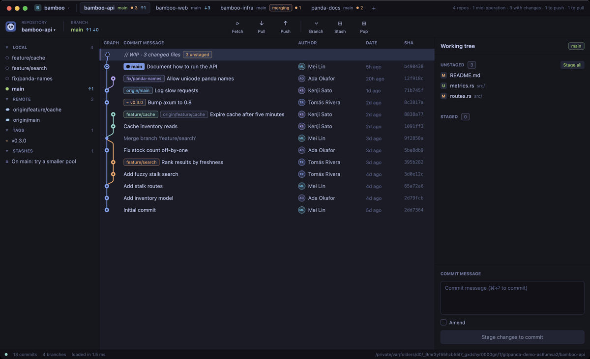

<div align="center">

<pre>
   ▄████▄               ▄████▄
  ████████▄▄▄▄▄▄▄▄▄▄▄▄▄████████
   ▀████▀               ▀████▀
   ▄▀                       ▀▄
  █      ▄▄▄▄       ▄▄▄▄      █
  █    ▄██████▄   ▄██████▄    █
  █   ███ ● ███   ███ ● ███   █
  █    ▀█████▀  ▄  ▀█████▀    █
   █            ▀            █
    ▀▄        ╰───╯        ▄▀
      ▀▀▄▄▄▄▄▄▄▄▄▄▄▄▄▄▄▄▄▀▀

 ██████╗  ██╗ ████████╗ ██████╗   █████╗  ███╗   ██╗ ██████╗   █████╗ 
██╔════╝  ██║ ╚══██╔══╝ ██╔══██╗ ██╔══██╗ ████╗  ██║ ██╔══██╗ ██╔══██╗
██║  ███╗ ██║    ██║    ██████╔╝ ███████║ ██╔██╗ ██║ ██║  ██║ ███████║
██║   ██║ ██║    ██║    ██╔═══╝  ██╔══██║ ██║╚██╗██║ ██║  ██║ ██╔══██║
╚██████╔╝ ██║    ██║    ██║      ██║  ██║ ██║ ╚████║ ██████╔╝ ██║  ██║
 ╚═════╝  ╚═╝    ╚═╝    ╚═╝      ╚═╝  ╚═╝ ╚═╝  ╚═══╝ ╚═════╝  ╚═╝  ╚═╝
</pre>

<b>▓▒░ a fast git client · line-level staging · GPU-drawn · Tokyo Night ░▒▓</b>

<br><br>


<br><br>

<a href="docs/demo.mp4"></a>

<sub>Recorded from the real app by <code>docs/make-demo.py</code> on a throwaway demo project. Click for the <a href="docs/demo.mp4">sharper video</a>.</sub>

</div>

---

## ✦ What it does

In the spirit of GitKraken, written in Rust on [gpui](https://crates.io/crates/gpui)
(Zed's GPU UI framework).

- **Commit graph.** Coloured lanes with curved merges, branch / tag / remote
  pills and a `// WIP` node for uncommitted work. Only the rows you can see
  are ever built.
- **Stage anything.** Whole files, **single hunks, or individual lines**:
  click lines (shift-click for a range), then use the hunk header buttons.
  Double-click a file to stage or unstage it. Discard works the same way.
- **Commit** with `⌘⏎`, **amend** with the last message preloaded.
- **Branches.** Create, checkout (double-click), **rename**, delete, merge
  into current, rebase current onto, push / force-push with lease, pull,
  fetch. Remote branches check out as tracking branches.
- **Interactive rebase** editor: pick / reword / squash / fixup / drop,
  reorder, edit messages. Shift-select commits → **Squash N commits**, or
  **Squash into parent** / **Reword** from any commit's menu.
- **Drop commits.** Right-click → **Drop commit…**, or shift-select several
  → **Drop N commits…** (`⌘⌫` works on the selection). Later commits are
  rebased and uncommitted changes are autostashed.
- **Conflict resolution.** A banner for merges, rebases, cherry-picks and
  reverts in progress (continue / skip / abort), and a resolver that shows
  ours and theirs per conflict: take ours, theirs, or both in either order,
  undo, then save and mark resolved.
- **Diffs** for working tree, index and commits, with **rename detection**.
  Files can be renamed (`git mv`) from the file menu.
- Cherry-pick, revert, reset (soft / mixed / hard), tags, stashes (push,
  pop, apply, drop), commit details with parents and changed files.
- **Live refresh** from a file-system watcher (gitignored paths ignored),
  plus a refresh whenever the window gets focus.

## 🎋 Projects

Group the repositories you work on together into a **project**. The bar at
the top shows each one as a tab, so you can see at a glance where the work is:

```
 ▣ bamboo ▾ │ bamboo-api main ●3 ↑1 │ bamboo-web main ↓3 │ bamboo-infra main [merging] ●1 │ +     4 repos · 1 mid-operation · 3 with changes
```

- Each tab shows the **branch**, **uncommitted changes** (●), **ahead / behind**
  its upstream (↑ ↓), and any **merge, rebase or cherry-pick in progress**.
  The end of the bar adds them up for the whole project.
- One repository is open at a time: click a tab or press **`⌘1`–`⌘9`**.
  Unsent commit messages are kept per repository.
- Opening a repository (`⌘O`, or `gitpanda path`) adds it to the active
  project, or switches to the project that already has it. Launched with no
  repository, gitpanda reopens where the active project was left.
- The ▾ menu switches, creates, renames and deletes projects. Right-click a
  tab to reorder it, copy its path, show it in Finder, or remove it.
- Projects live in a plain text file you can edit by hand:
  `~/.config/gitpanda/projects` (or wherever `GITPANDA_PROJECTS` points).

  ```ini
  active = bamboo
  [bamboo]
  * /Users/me/code/bamboo-api
  /Users/me/code/bamboo-web
  ```

  `*` marks each project's last open repository.

## ⚡ Install and run

You need macOS and a recent stable [Rust toolchain](https://rustup.rs). gpui
also targets Linux, but that's untested here.

**Try it without installing:**

```sh
git clone https://github.com/danihegglin/gitpanda.git
cd gitpanda
cargo run --release -- /path/to/repo     # or run it inside a repo
```

**Install the `gitpanda` command** (into `~/.cargo/bin`):

```sh
cargo install --git https://github.com/danihegglin/gitpanda
# or, from a clone:
cargo install --path .
```

The first build compiles gpui and takes a few minutes; after that it's quick.

## ⌨ Keys

| Key | Action |
|---|---|
| `↑ ↓` / `j k` | move through commits (shift extends the selection) |
| `→` / `l` | open the selected commit's first changed file |
| `↑ ↓` / `j k` (file open) | previous / next changed file |
| `←` / `h` | close the file, back to the graph |
| `⌘⏎` | commit |
| `⌘B` | new branch at the selected commit |
| `⇧⌘S` | stash |
| `⌘⌫` | drop the selected commit(s) |
| `⌘1`–`⌘9` | switch to the project's nth repository |
| `⌘O` | open a repository |
| `⌘R` | refresh |
| `⌘C` | copy the selected commit's SHA |
| `esc` | close diff / dialog / menu |
| rebase editor | `p r s f d` set the action, `⌥↑↓` reorder, `⏎` start |

Right-click commits, branches, tags, stashes, files and repository tabs for
everything else.

## 🚀 Why it's fast

- **The UI thread never touches the repository.** Reads use libgit2 on a
  background thread and arrive as immutable snapshots.
- **History is walked once.** The walked history is cached and reused until a
  ref moves, so the common reload (after an edit or a stage) only re-reads
  refs and status.
- **Everything is virtualized.** Every list is a `uniform_list`, so the graph
  costs the same with 50 commits or 50,000.

On ripgrep's history (2.3k commits, 289 refs) a cold load takes ~40 ms and a
warm reload ~7.5 ms. Measure your own repository with:

```sh
cargo run --release -- --bench /path/to/repo
```

## 🧬 How it's built

- `src/git/`: `repo.rs` builds snapshots (refs, history, status) and the
  project bar's per-repository summaries, `graph.rs` lays out lanes,
  `diff.rs` loads diffs and builds partial patches for hunk and line staging,
  `conflict.rs` parses and resolves conflict markers, and `ops.rs` runs every
  mutation through the `git` CLI, so hooks, config and credentials behave
  exactly like your own git (interactive rebase is scripted through
  `GIT_SEQUENCE_EDITOR`).
- `src/ui/`: one root view (`app.rs`) owns all state; each region renders
  from its own module, and `projects.rs` draws the project bar.
- `src/workspace.rs`: projects and the file they're saved in.

## 🛠 Building and hacking

```sh
cargo test                  # unit tests plus end-to-end tests against throwaway repositories
python3 docs/make-demo.py   # re-record the README demo (macOS, needs ffmpeg)
```

The end-to-end tests cover line staging, hunk discard, squash, reword, fixup,
merge conflict resolution, branch rename and rename detection.

For UI work, `GITPANDA_SCRIPT` drives the live app and screenshots it (macOS;
a process may always capture its own window):

```sh
GITPANDA_SCRIPT="wait 1000; call select 3; shot /tmp/a.png; quit" cargo run -- .
```

The default `runtime-shaders` feature compiles the Metal shaders at startup,
so you don't need Xcode's Metal toolchain. To precompile them instead, run
`xcodebuild -downloadComponent MetalToolchain` and build with
`--no-default-features`.
